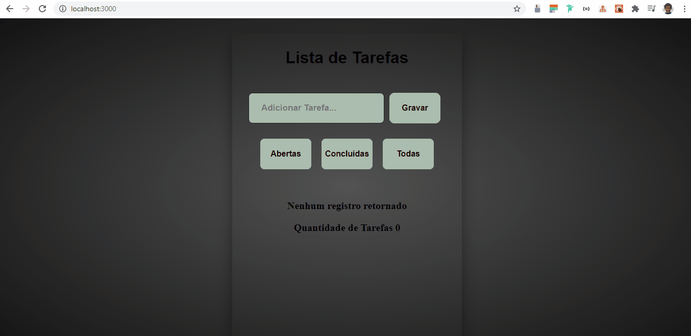

<h1>
Projeto Lista de Tarefas feito em React utilizando Context API e Hooks.
</h1>

<h1>
 
</h1>

 Como vocês podem ver no gif, o projeto controla os states através  da context API  e armazena os dados no local storage. Lista todas as tarefas, as concluidas e as não concluidas, realizando a contagem de ambas. Para criar os icons foi utilizado a lib react-icons, através dessa lib importamos os components necessários e utilizamos no app.
